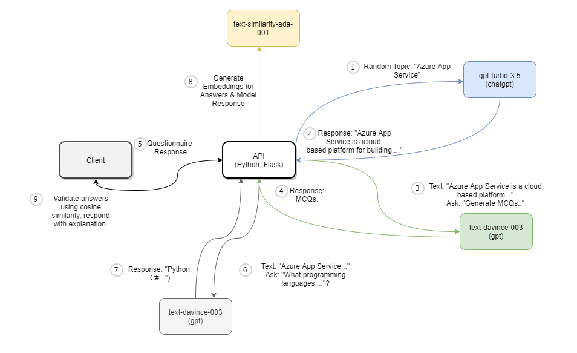
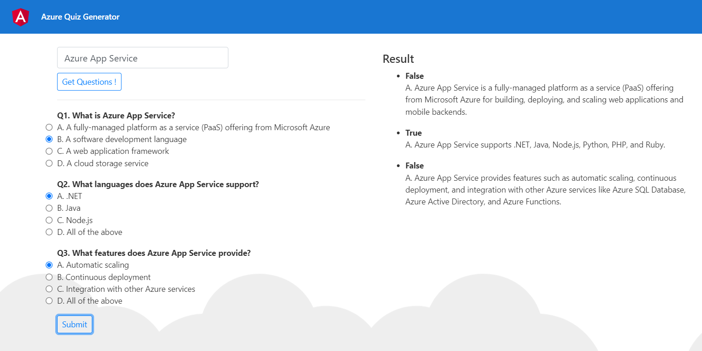
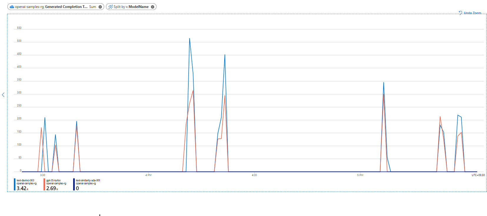

# Quiz Generator using Azure Open-AI 

## Introduction

This sample demonstrates the value of advanced large language models (LLMs) from Azure Open AI.

### Problem Statement

Screening entry level candidates like engineers on Azure Knowledge is a time taking activity. Traditionally there are two ways

- Personal Interview -  In this method interviewer sits with the candidate to assess the knowledge, though this is the most ideal way it is time taking and hectic specially when you want to screen a large group of candidates.
- Automated Questionnaire - In this method a tool is fed with pre-baked questionnaire and the system pics questions randomly (like Azure Certification Exams). This reduces the overhead to quickly filter, however overtime the questions become stale and need updates.

This tool addresses the above common problems. It is capable of generating sample questionnaire on Azure Topics prompted by the end user, validate the response and also provide explanation for each response. It helps in screening candidates on Azure Knowledge & Training purpose.

_Note: The tool is an MVP, it is not production ready. It is developed to create knowledge on building applications using Azure Open AI, the models hallucinate at times so does the application :)._

_Note: The topics to generate Questionnaire is not limited to Azure, it can generate on any topic. Azure here is an example, in more realistic case the questionnare is generated from existing knowledge base which could be internal to the company._


## Setup

### Pre-requisites

This sample is tested with WSL , Linux.
Windows users ensure the machine has all dependencies listed in requirements.txt.

- Windows with WSL / Linux machine
- Azure Subscription 
- Azure Open AI Service enabled. For instructions on how to enable click [here](https://aka.ms/oai/access)


###  Model Deployment

Once open AI service is enabled you need to deploy the models before starting to make API calls. 
The script `deploy-models.ps1` deploys 3 models

- chatgpt (gpt-35-turbo). This is used for generating content for a given topic.
- text-davinci. This is used for generating questions and options as well as the answer for the question.
- text-similarity-ada-001. This is used to find the similarity between answer provided by model and the option choosen by the user.

```
# To execute the script run the below command.
deploy-models.ps1
```


## Usage Analytics. 


## High level Flow.

The following diagrams shows the high level flow.
- Step 1: User selects a topic by entering the topic name into `Text Box`
- Step 2: The application uses chat gpt model (gpt-35-turbo) to generate text related to the topic. *For a production scenario you may feed an existing text corpus, chaptgpt is used here only for demostration purpose.*
- Step 3: The application uses the text and appends additional prompt to generate MCQs. 
- Step 4: The application sends the questions as the response
- Step 5: User selects the answers and clicks `Submit`
- Step 6: The application finds the correct answer for each question by using the text generated in Step 2 & question by using gpt model.
- Step 7: The application receives descriptive answer for each question.
- Step 8: The application uses similarity model to find the cosine similarity between the vectors of option chosen by the user and the answer provided by the gpt model.
- Step 9: The application marks the questions as `Correct` if the option with highest cosine similarity is chosen by the user.



### UI Screenshots 



## Cost Model.

Azure Open AI uses pay-per-use consumption models. Each model has a different price charged per 1000 tokens. Ada, Babbage, Currie, Davinchi are the text-based language models available with the Azure Open AI service today, the price of these models increases from left to right. Complex models have a higher price than less complex ones. Refer to this [page](https://azure.microsoft.com/en-us/pricing/details/cognitive-services/openai-service/) for details on pricing per model.

Choosing the right model for your use case is very important so that it fits into the budget & also capable of generating right responses for the prompt. 
For example, davince model is the most capable model among the others, and it can understand complex intent. It is also costlier than the others less complex models.
For simpler tasks you may opt for cheaper models like ADA, BABBAGE that are 50% cheaper than davinci. From a more practical standpoint, it is recommended to start with davince and settle for less complex model as you build your application.

In most of the cases you might want to know the cost upfront for a given corpus of text. Azure Open AI cost depends on the number of tokens, which is including tokens in the prompt/input (also called `prompt tokens`) and generated/output tokens (also called `completion tokens`). A token can be word or sub-word, by reading a corpus of text number of tokens cannot be determined directly. However as per Open AI standards number of tokens is believed to be 1.4 times the number of words in the text. This repo offers a more effective way of calculating the cost of using Azure Open AI using an tokenization library called tiktoken (refer `compute_token.ipynb` for example). 

In repeated experiments it is observed that this count exactly matches the Azure Open AI tokenization. Here is an example for the usecase where the model generates questions from a given corpus of text. (This is taken from log of the application)

The below  is the input given to text-davinci-003 model, for generating the questions
```
Azure App Service is a fully managed platform for building, deploying, and scaling web apps, mobile backends, and RESTful APIs. It provides a fully managed platform for building, deploying, and scaling web apps, mobile backends, and RESTful APIs. Azure App Service supports multiple programming languages including .NET, Java, Node.js, Python, and PHP, and integrates with various tools and services such as Visual Studio, GitHub, and Azure DevOps. It also provides built-in support for continuous deployment, auto-scaling, and load balancing, making it easy to deploy and manage applications at scale. Additionally, Azure App Service provides features such as authentication and authorization, SSL/TLS encryption, and custom domain support to ensure the security and reliability of applications.
```
Tokens generated as per the tiktoken library: 195 (prompt tokens) 130 (completion tokens). Below is the response from Azure Open AI which matches the count shown above.
```
{
  "choices": [
    {
      "finish_reason": "stop",
      "index": 0,
      "logprobs": null,
      "text": "\n\nQ1. What is Azure App Service?\nA. A web development platform\nB. A mobile backend platform\nC. A RESTful API platform\nD. All of the above\n\nQ2. What programming languages does Azure App Service support?\nA. Java\nB. Node.js\nC. Python\nD. All of the above\n\nQ3. What features does Azure App Service provide to ensure the security and reliability of applications?\nA. Continuous deployment\nB. Auto-scaling\nC. Load balancing\nD. Authentication and authorization, SSL/TLS encryption, and custom domain support"
    }
  ],
  "created": 1681732637,
  "id": "cmpl-76HltJClK4wpCPl85pE0SIGoqdtdw",
  "model": "text-davinci-003",
  "object": "text_completion",
  "usage": {
    "completion_tokens": 130,
    "prompt_tokens": 195,
    "total_tokens": 325
  }
}

```

For a application in production, you can always find the tokens per model by navigating to the Metrics blade. Below is a snapshot from the Azure Portal.



## Running the application

Run the below command to run the API from root (azure-quiz). Ensure the API key is initialized in `quiz-generator.py'

```
python3 quiz-generator.py
```

Run the below command from folder `quizgen`. 
This application points to API at http://127.0.0.1:5000
```
ng serve
```


