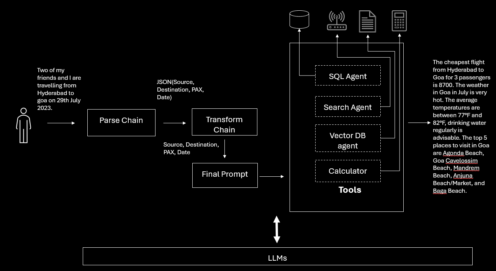

# Build an end-to-end AI app using Azure Open AI, langchain, Azure Search Vector database.

Large language models are generative models which are capable of generating text in response to a question, analytical reasoning or summary. 
However, when you build an AI applications using LLMs there are a few fundamental aspects of application programming that needs attentions, example
- What if you want to restrict the response to domain knowledge ? The domain knowledge here can be both structured and unstructured.
- What if you want to get latest information from web ? (Rememeber, the training data for LLM models is restricted to date.)
- What if you want to use multiple models ? Say Similarity model, embeddings model.
Langchain is one framework which helps you in building a compact AI App by providing a pluggable framework.
Using the 6 key modules we can easily solve the above challenges and langchain aids in abstracting away the implementation details. 
This notebook teaches you to build an end-to-end AI application using langchain's LLM, tools and prompt template modules.
The different kinds of tools used in this notebook are - SQL, Calculator, SERP API for search and Vector DB.
In this notebook you will also learn to store documents as vector embeddings on Azure Search for performing semantic search.

### End-to-end Flow.




### Who is this notebook for ?

Before proceeding further, basic knowledge on the below concepts is recommended.

- Langchain (https://python.langchain.com/docs/get_started/introduction)
- Semantic Search in Azure Search (https://learn.microsoft.com/en-us/azure/search/semantic-search-overview#enable-semantic-search)
- Azure Open AI models (https://learn.microsoft.com/en-us/azure/ai-services/openai/concepts/models)

## Pre-requisites to run the application.

To run this code, you will need the following:

1. Azure Subscription with Azure Open AI Enabled. More details [here](https://learn.microsoft.com/en-us/legal/cognitive-services/openai/limited-access)
1. A deployment of the `text-embedding-ada-002` embedding model in your Azure OpenAI service. 
1. Azure OpenAI connection and model information:
   - OpenAI API key
   - OpenAI embedding model deployment name
   - OpenAI API version
1. Access to Cognitive Search vector search private preview, since this is the vector search-enabled version of this sample. You can sign up [here](https://aka.ms/VectorSearchSignUp).

## Infra setup.

1. Create Open AI Service & deploy models. For simplicity use the model name as deployment name.
   - `text-embedding-ada-002`
   - `text-davinci-003` 
   - `text-similarity-davinci-001` (this is optional)
Instructions to deploy models available [here](https://microsoftlearning.github.io/mslearn-openai/Instructions/Labs/01-get-started-azure-openai.html)

1. Create Azure Cognitive Service Search with Vector DB. 
   - Create Azure Cognitive Services Search (https://learn.microsoft.com/en-us/azure/search/search-get-started-vector#prerequisites)
   - Enable Vector DB (https://learn.microsoft.com/en-us/azure/search/semantic-search-overview#enable-semantic-search)
   - Create Index

   2.1 Run the below script to check if ACS account created above has Vector DB extension enabled

   ``````
   curl --location 'https://{vector-search-name}.search.windows.net/indexes?api-version=2023-07-01-Preview' --header 'api-key: {api-key}' --header 'Content-Type: application/json' --data ' {
      "name": "do-i-have-vector-search",
      "fields": [
        {
          "name": "id",
          "type": "Edm.String",
          "key": true
        },
        {
          "name": "MyVectorField",
          "type": "Collection(Edm.Single)",
          "searchable": true,
          "filterable": false,
          "sortable": false,
          "facetable": false,
          "retrievable": true,
          "analyzer": "",
          "dimensions": 5,
          "vectorSearchConfiguration": "vectorConfig"
        }
      ],
        "vectorSearch": {
            "algorithmConfigurations": [
                {
                    "name": "vectorConfig",
                    "kind": "hnsw"
                }
            ]
        }
    }'
    ```
2.2  Run the below script to create the index in ACS.

```
curl --location --request PUT 'https://{vector-search-name}.search.windows.net/indexes/langchain-vector-demo?api-version=2023-07-01-Preview' \
--header 'Content-Type: application/json' \
--header 'api-key: {api-key}' \
--data '{
    "name": "langchain-vector-demo",
    "fields": [
        {
            "name": "id",
            "type": "Edm.String",
            "key": true,
            "filterable": true
        },
        {
            "name": "category",
            "type": "Edm.String",
            "filterable": true,
            "searchable": true,
            "retrievable": true
        },
        {
            "name": "title",
            "type": "Edm.String",
            "searchable": true,
            "retrievable": true
        },
        {
            "name": "titleVector",
            "type": "Collection(Edm.Single)",
            "searchable": true,
            "retrievable": true,
            "dimensions": 1536,
            "vectorSearchConfiguration": "vectorConfig"
        },
        {
            "name": "content",
            "type": "Edm.String",
            "searchable": true,
            "retrievable": true
        },
        {
            "name": "contentVector",
            "type": "Collection(Edm.Single)",
            "searchable": true,
            "retrievable": true,
            "dimensions": 1536,
            "vectorSearchConfiguration": "vectorConfig"
        }
    ],
    "corsOptions": {
        "allowedOrigins": [
            "*"
        ],
        "maxAgeInSeconds": 60
    },
    "vectorSearch": {
        "algorithmConfigurations": [
            {
                "name": "vectorConfig",
                "kind": "hnsw"
            }
        ]
    },
    "semantic": {
        "configurations": [
            {
                "name": "my-semantic-config",
                "prioritizedFields": {
                    "titleField": {
                        "fieldName": "title"
                    },
                    "prioritizedContentFields": [
                        {
                            "fieldName": "content"
                        }
                    ],
                    "prioritizedKeywordsFields": []
                }
            }
        ]
    }
}'
```

3. Create an Azure SQL database. Run the script `infra\flights.sql` to create the table and seed the table with dummy data.

4. Configure `.env` with values from your infra setup.


